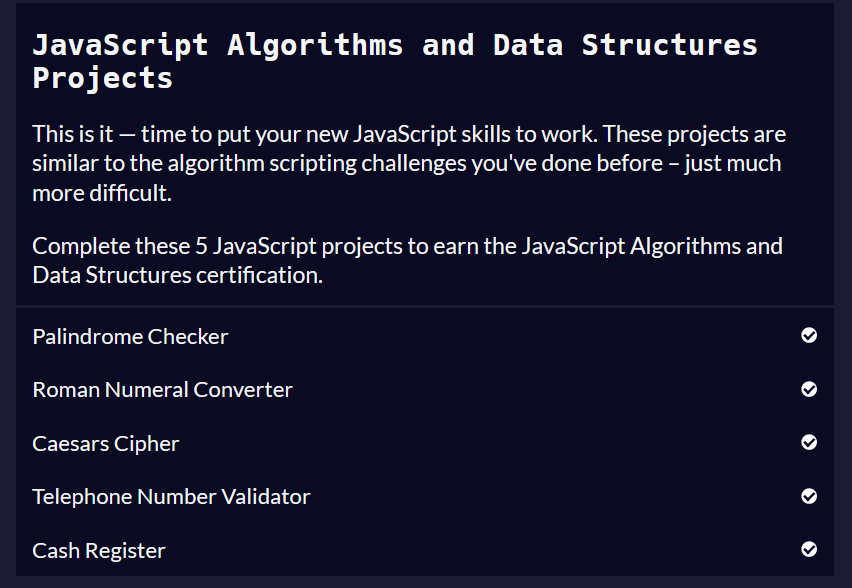

# Desafio 1 - Algoritmos e Lógica de Programação em JavaScript

Este desafio tem como objetivo resolver a última seção “JavaScript Algorithms and Data Structures Projects” do curso da FreeCodeCamp - Algoritmos e estruturas de dados em JavaScript. A imagem a seguir mostra a conclusão da seção: 

